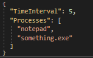
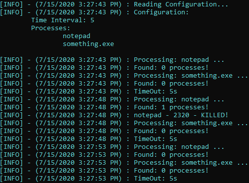

# PSK
## PSK - Process Scanner Killer
## Simple Process Killer with configurable blacklist
# Info
<strong>PSK</strong> can be executed in two different ways:
- Step-by-step mode
- Loop mode

### Example of blacklist

- <strong>TimeInterval</strong> - Timeout when using it in a loop - non step-by-step
- <strong>Processes</strong> - Names of processes to be killed

# Screenshoot

# Setup & Run
- configure blacklist and timeout in `blacklist.json`
- Open up `VS` and choose mode via contructor: param `stepbystep`
- Hit `F5` to run
- Enjoy 😊
